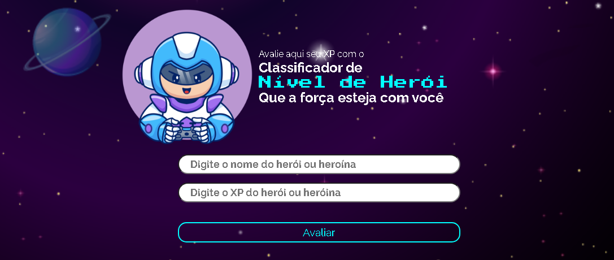

# ⚔️ Desafio: Classificador de Nível de Herói 🎮

Seja bem-vindo ao repositório Classificador de Nível de Herói, um projeto interativo desenvolvido para avaliar e categorizar heróis com base na quantidade de experiência (XP). 🚀

🛡️ Sobre o Projeto - Objetivo:
Este projeto tem como objetivo proporcionar uma experiência simples e intuitiva para classificar heróis conforme suas pontuações de XP. Desenvolvido com as tecnologias HTML, CSS, e JavaScript, a solução combina funcionalidade e design responsivo para garantir uma navegação fluida e atrativa.

## 🗡️ Funcionalidades

✅ Entrada de Dados (Inputs):

Nome do Herói ou Heroína: Permite ao usuário inserir o nome do personagem que deseja classificar.
XP (Experiência): O usuário pode informar a quantidade de experiência acumulada pelo herói ou heroína.
Classificação Automática:

✅ Com base no valor de XP informado, o sistema classifica o herói ou heroína em diferentes patentes de nível:
Ferro: XP menor que 1.000.
Bronze: XP entre 1.001 e 2.000.
Prata: XP entre 2.001 e 5.000.
Ouro: XP entre 5.001 e 7.000.
Platina: XP entre 7.001 e 8.000.
Ascendente: XP entre 8.001 e 9.000.
Imortal: XP entre 9.001 e 10.000.
Radiante: XP maior ou igual a 10.001.

✅ Exibição do Resultado:

O nível correspondente ao XP informado é exibido, permitindo ao usuário visualizar a classificação final do herói ou heroína de maneira rápida e objetiva.

## 🛰️ Tecnologia aplicadas:

## ⛏️ Estrutura do Projeto

desafio-nivel-heroi/
├── assets/                      # Recursos utilizados no projeto
│   ├── css/                     # Arquivos de estilo
│   │   ├── reset.css            # Reseta estilos padrão dos navegadores
│   │   ├── style.css            # Estilos principais do projeto
│   ├── img/                     # Imagens para o design da aplicação
│   │   ├── favicon.png          # Ícone da aplicação
│   │   ├── hero.png             # Imagem do herói
│   │   ├── space.png            # Imagem de fundo
│   ├── scripts/                 # Arquivos JavaScript
│       ├── scripts.js           # Lógica principal do projeto
├── index.html                   # Arquivo principal do projeto
└── README.md                    # Documentação do projeto

🌐 Page: https://ricardomarques28.github.io/desafio-nivel-heroi/

Volte sempre! 💪🎯

